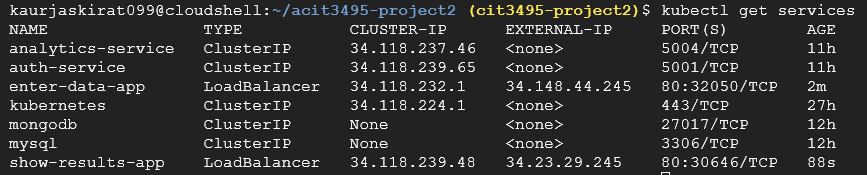

# ACIT 3495 – Project 2: Kubernetes Deployment & Horizontal Scalability

**Course:** ACIT 3495 – Advanced Topics in IT Infrastructure  
**Team:** Salome Chelsie Lele Wambo · Jaskirat Gill · Jessica Shokouhi  
**Repository:** [github.com/GillJaskiart/acit3495-project2](https://github.com/GillJaskiart/acit3495-project2)  
**Cloud Provider:** Google Cloud Platform (GKE) — Region: `us-east1`

---

## Table of Contents

1. [Project Overview](#1-project-overview)
2. [Architecture](#2-architecture)
3. [Services](#3-services)
4. [Technologies Used](#4-technologies-used)
5. [Kubernetes Deployment](#5-kubernetes-deployment)
6. [Horizontal Scalability](#6-horizontal-scalability)
7. [CI/CD Pipeline](#7-cicd-pipeline)
8. [Getting Started — Local (Docker Compose)](#8-getting-started--local-docker-compose)
9. [Getting Started — Cloud (GKE)](#9-getting-started--cloud-gke)
10. [API Endpoints](#10-api-endpoints)
11. [Load Testing Results](#11-load-testing-results)
12. [Design Decisions](#12-design-decisions)
13. [Challenges & Solutions](#13-challenges--solutions)
14. [Team Contributions](#14-team-contributions)

---

## 1. Project Overview

Project 2 extends the containerized microservices system built in Project 1 by deploying it to a managed **Kubernetes cluster on Google Cloud (GKE)** and demonstrating **horizontal scalability** under real load.

Project 1 delivered a fully containerized data collection and analytics platform running locally via Docker Compose. Project 2 takes that same system and:

- Translates all Docker Compose services into **Kubernetes manifests** (Deployments, StatefulSets, Services, ConfigMaps, Secrets, PersistentVolumeClaims)
- Deploys every service to a **live GKE cluster** in `us-east1`
- Configures **Horizontal Pod Autoscalers (HPA)** so services automatically scale up under load and back down when traffic drops
- Validates scalability with a **k6 load test** that ramps from 10 to 100 virtual users
- Automates deployments with a **GitHub Actions CI/CD pipeline** per service

The system collects customer, product, and sales data through a web interface, authenticates users via JWT, computes analytics from MySQL, and displays results from MongoDB — all running as independent microservices on Kubernetes.

---

## 2. Architecture

### System Architecture Diagram

```
                        ┌─────────────────────────────────────────────┐
                        │            GKE Cluster  (us-east1)          │
                        │                                             │
  Browser ──────────────►  enter-data-app   (LoadBalancer :80)        │
                        │       │                                     │
                        │       ▼                                     │
  Browser ──────────────►  show-results-app (LoadBalancer :80)        │
                        │       │                                     │
                        │       ▼                                     │
                        │  auth-service     (ClusterIP :5001)         │
                        │       │                                     │
                        │  analytics-service(ClusterIP :5004)         │
                        │       │                 │                   │
                        │       ▼                 ▼                   │
                        │    MySQL            MongoDB                 │
                        │  (StatefulSet)    (StatefulSet)             │
                        │       │                 │                   │
                        │    PVC 5Gi           PVC 5Gi                │
                        └─────────────────────────────────────────────┘
                                      │
                          GitHub Actions CI/CD
                          (build → push GCR → rollout)
```

### Request Flow

1. User opens the **Enter Data** or **Show Results** web app via the LoadBalancer external IP
2. If not authenticated, the app calls **auth-service** `/login` → receives a JWT token stored in an HTTP-only cookie
3. Every protected route calls **auth-service** `/verify` before processing the request
4. **Enter Data** writes customers, products, and sales to **MySQL**
5. **Analytics Service** reads from MySQL, computes max/min/avg statistics, and writes results to **MongoDB**
6. **Show Results** reads the latest analytics document from **MongoDB** and displays it

### Project 1 → Project 2 Mapping

| Service | Project 1 | Project 2 |
|---|---|---|
| auth-service | Docker container port 5001 | Deployment + ClusterIP Service |
| enter-data-app | Docker container port 5000 | Deployment + LoadBalancer + HPA |
| show-results-app | Docker container port 5002 | Deployment + LoadBalancer + HPA |
| analytics-service | Docker container port 5004 | Deployment + ClusterIP + HPA |
| MySQL | Docker container port 3307 | StatefulSet + PVC + ClusterIP |
| MongoDB | Docker container port 27017 | StatefulSet + PVC + ClusterIP |

---

## 3. Services

### Enter Data App (Python / Flask — port 5000)
A web application that allows authenticated users to submit structured data into the system.

- **Add Customer** — name and email, stored in MySQL `customers` table
- **Add Product** — name and price, stored in MySQL `products` table
- **Record Sale** — links a customer to a product with a quantity, stored in MySQL `orders` table
- Validates credentials through the Authentication Service before allowing access

### Show Results App (Python / Flask — port 5002)
A web application that displays the latest analytics results to authenticated users. Reads directly from MongoDB — no computation happens here.

### Authentication Service (Node.js / Express — port 5001)
A stateless JWT service shared by both web apps.

- `POST /login` — validates credentials, returns a signed JWT token (expires in 1 hour)
- `GET /verify` — validates an incoming Bearer token and returns the username
- Hardcoded users for demonstration: `admin / admin123` and `user / user123`

### Analytics Service (Python / Flask — port 5004)
A backend service that reads from MySQL and writes computed results to MongoDB.

- `POST /run-analytics` — queries MySQL for the highest-selling product and top customer by purchase value, stores results in MongoDB
- `GET /analytics-status` — returns the latest analytics document from MongoDB

### MySQL (port 3306 internal)
Relational database storing all transactional data. Deployed as a Kubernetes **StatefulSet** with a 5Gi PersistentVolumeClaim so data survives pod restarts.

Schema:
- `customers (customer_id, customer_name, email)`
- `products (product_id, product_name, product_price)`
- `orders (order_id, purchase_date, customer_id, product_id, quantity)`

### MongoDB (port 27017 internal)
Document database storing analytics results. Deployed as a Kubernetes **StatefulSet** with a 5Gi PersistentVolumeClaim.

Collection: `analytics` — one document of type `latest` that gets replaced on each analytics run.

---

## 4. Technologies Used

| Layer | Technology |
|---|---|
| Web framework | Python 3.11 + Flask |
| Auth service | Node.js 20 + Express + jsonwebtoken |
| Relational DB | MySQL 8.0 |
| Document DB | MongoDB 7.0 |
| Containerization | Docker |
| Orchestration | Kubernetes (GKE) |
| Cloud provider | Google Cloud Platform — us-east1 |
| Container registry | Google Container Registry (GCR) |
| Load testing | k6 |
| CI/CD | GitHub Actions |
| API documentation | OpenAPI 3.0 |

---

## 5. Kubernetes Deployment

### Manifest Structure

```
k8s/
├── secrets.yaml                  # DB credentials, JWT secret, Mongo URI
├── configmap.yaml                # Non-secret env vars (hosts, ports, URLs)
├── mysql-init-configmap.yaml     # Embeds init.sql to create tables on first boot
├── mysql-statefulset.yaml        # MySQL StatefulSet + PVC
├── mysql-service.yaml            # Headless ClusterIP for MySQL
├── mongodb-statefulset.yaml      # MongoDB StatefulSet + PVC
├── mongodb-service.yaml          # Headless ClusterIP for MongoDB
├── auth-deployment.yaml          # auth-service Deployment + ClusterIP Service
├── analytics-deployment.yaml     # analytics-service Deployment + ClusterIP Service
├── analytics-hpa.yaml            # HPA: analytics-service scales 1→3 at 60% CPU
├── enter-data-deployment.yaml    # enter-data-app Deployment + LoadBalancer Service
├── enter-data-hpa.yaml           # HPA: enter-data-app scales 1→5 at 50% CPU
├── show-results-deployment.yaml  # show-results-app Deployment + LoadBalancer Service
└── show-results-hpa.yaml         # HPA: show-results-app scales 1→5 at 50% CPU
```

### Key Design Choices

**StatefulSets for databases** — MySQL and MongoDB use StatefulSets rather than Deployments because they require stable network identity and persistent storage. Each has its own PersistentVolumeClaim backed by GKE's default storage class, ensuring data survives pod restarts and rescheduling.

**ClusterIP for internal services** — `auth-service` and `analytics-service` are not exposed externally. They use ClusterIP services so they are only reachable within the cluster. This follows the principle of least exposure.

**LoadBalancer for web apps** — `enter-data-app` and `show-results-app` use LoadBalancer services so GKE provisions a Google Cloud external load balancer with a public IP, making the web apps reachable from a browser without manual port-forwarding.

**Secrets and ConfigMaps** — All credentials (DB passwords, JWT secret) are stored in a Kubernetes Secret. Non-sensitive configuration (service hostnames, ports) is in a ConfigMap. Neither is hardcoded in any application image.

**Resource requests and limits on every container** — Required for HPA to function. Without CPU requests set, the Metrics Server cannot compute utilization percentages and HPA targets show `<unknown>`.

### Screenshot — All Pods Running

> ****

### Screenshot — All Services with External IPs



---

## 6. Horizontal Scalability

### Metrics Server

The Kubernetes Metrics Server was installed to enable CPU-based autoscaling:

```bash
kubectl apply -f https://github.com/kubernetes-sigs/metrics-server/releases/latest/download/components.yaml
```

Without the Metrics Server, HPAs cannot read pod CPU utilization and all TARGETS show `<unknown>`.

### HPA Configuration

Three services are configured with Horizontal Pod Autoscalers:

| Service | Min Replicas | Max Replicas | CPU Target |
|---|---|---|---|
| enter-data-app | 1 | 5 | 50% |
| show-results-app | 1 | 5 | 50% |
| analytics-service | 1 | 3 | 60% |

MySQL and MongoDB are **not** autoscaled — databases require careful coordination before horizontal scaling and a single StatefulSet replica is sufficient for this project's load.

### Screenshot — HPAs with Targets Populated

> ****

### Load Test Design (k6)

The load test is defined in `load-test/test.js` and uses k6's stage API to simulate a realistic traffic ramp:

```
Stage 1: 0 → 10 virtual users over 30s   (warm up)
Stage 2: 10 → 50 virtual users over 60s  (trigger HPA scale-up)
Stage 3: 50 → 100 virtual users over 2m  (sustain peak load)
Stage 4: 100 → 0 virtual users over 30s  (ramp down, trigger scale-down)
```

Each virtual user makes GET requests to `/login` on both the Enter Data and Show Results apps, checking that HTTP 200 responses are returned.

### Scale-Up Observed

> ****

### Scale-Down Observed

> ****

### HPA Event Log

> ****

---

## 7. CI/CD Pipeline

A GitHub Actions workflow is defined for each of the four application services. Every workflow triggers on a push to `main` that touches files in that service's directory.

### Pipeline Steps (per service)

```
1. Checkout code
2. Authenticate with GCP using service account key (stored as GitHub Secret)
3. Set up gcloud CLI
4. Configure Docker to push to Google Container Registry
5. docker build → docker push to gcr.io/cit3495-project2/<service>:latest
6. gcloud container clusters get-credentials (connect kubectl to GKE)
7. kubectl rollout restart deployment/<service>  (rolling update — zero downtime)
```

### Workflow Files

| File | Triggers On |
|---|---|
| `.github/workflows/auth-service.yml` | Push to `auth-service/**` |
| `.github/workflows/analytics-service.yml` | Push to `analytics-service/**` |
| `.github/workflows/enter-data.yml` | Push to `enter-data-app/**` |
| `.github/workflows/show-results.yml` | Push to `show-results-app/**` |

### GitHub Secrets Required

| Secret | Value |
|---|---|
| `GCP_SA_KEY` | Full JSON content of the GCP service account key |
| `GCP_PROJECT_ID` | `cit3495-project2` |

### Screenshot — Successful CI/CD Pipeline Run

> **[SCREENSHOT: GitHub Actions tab showing a green (successful) workflow run for one of the services, with all steps checked]**

---

## 8. Getting Started — Local (Docker Compose)

For local development and testing without Kubernetes.

### Prerequisites

- [Docker Desktop](https://www.docker.com/products/docker-desktop)
- [Git](https://git-scm.com/downloads)

### Setup

```bash
# Clone the repository
git clone https://github.com/GillJaskiart/acit3495-project2.git
cd acit3495-project2

# Copy and configure environment variables
cp .env.example .env
# Edit .env with your credentials if needed

# Build and start all services
docker compose up --build -d

# Verify all containers are running
docker ps
```

### Local URLs

| Service | URL |
|---|---|
| Enter Data App | http://localhost:5000 |
| Show Results App | http://localhost:5002/results |
| Auth Service | http://localhost:5001 |
| Analytics Service | http://localhost:5004 |

### Trigger Analytics

After entering some data, run analytics manually:

```bash
curl -X POST http://localhost:5004/run-analytics
```

Then refresh the Show Results app to see the updated output.

### Stopping

```bash
docker compose down        # stop containers
docker compose down -v     # stop and delete all data volumes (full reset)
```

---

## 9. Getting Started — Cloud (GKE)

### Prerequisites

- [gcloud CLI](https://cloud.google.com/sdk/docs/install) installed
- [kubectl](https://kubernetes.io/docs/tasks/tools/) installed
- `gke-gcloud-auth-plugin` installed: `gcloud components install gke-gcloud-auth-plugin`
- Access to the GCP project `cit3495-project2` (Chelsie must grant IAM access)

### Connect to the Cluster

```bash
gcloud auth login
gcloud config set project cit3495-project2
gcloud container clusters get-credentials cit3495-cluster --region us-east1 --project cit3495-project2

# Verify
kubectl get nodes
```

### Deploy All Services

```bash
# Apply in this order — secrets and DBs must come before apps
kubectl apply -f k8s/secrets.yaml
kubectl apply -f k8s/configmap.yaml
kubectl apply -f k8s/mysql-init-configmap.yaml
kubectl apply -f k8s/mysql-statefulset.yaml
kubectl apply -f k8s/mysql-service.yaml
kubectl apply -f k8s/mongodb-statefulset.yaml
kubectl apply -f k8s/mongodb-service.yaml

# Wait for DBs to be Running before continuing
kubectl get pods --watch

kubectl apply -f k8s/auth-deployment.yaml
kubectl apply -f k8s/analytics-deployment.yaml
kubectl apply -f k8s/enter-data-deployment.yaml
kubectl apply -f k8s/show-results-deployment.yaml

# Install Metrics Server then apply HPAs
kubectl apply -f https://github.com/kubernetes-sigs/metrics-server/releases/latest/download/components.yaml
kubectl apply -f k8s/analytics-hpa.yaml
kubectl apply -f k8s/enter-data-hpa.yaml
kubectl apply -f k8s/show-results-hpa.yaml
```

### Get the External IPs

```bash
kubectl get services
# Look for EXTERNAL-IP on enter-data-app and show-results-app
# These are the public URLs for the web apps
```

### Run the Load Test

```bash
# Install k6 first: https://grafana.com/docs/k6/latest/set-up/install-k6
# Fill in the external IPs in load-test/test.js first, then:
k6 run load-test/test.js
```

### Useful kubectl Commands

```bash
kubectl get pods                        # list all pods and status
kubectl get pods --watch                # live-watch pod changes
kubectl get services                    # list services and external IPs
kubectl get hpa                         # list HPAs and current CPU targets
kubectl describe hpa enter-data-hpa     # full HPA details + scaling events
kubectl top pods                        # live CPU and memory usage
kubectl logs <pod-name>                 # view logs for a pod
kubectl rollout restart deployment/<n>  # force a rolling redeploy
```

---

## 10. API Endpoints

### Auth Service (internal — ClusterIP :5001)

| Method | Endpoint | Description |
|---|---|---|
| POST | `/login` | Submit credentials, receive JWT token |
| GET | `/verify` | Validate a Bearer token |
| GET | `/health` | Health check |

**Login request body:**
```json
{ "username": "admin", "password": "admin123" }
```

**Login response:**
```json
{ "token": "<jwt>", "expires_in": 3600 }
```

**Verify header:**
```
Authorization: Bearer <token>
```

**Hardcoded users:** `admin / admin123` · `user / user123`

### Enter Data App (external — LoadBalancer :80)

| Method | Endpoint | Description |
|---|---|---|
| GET/POST | `/login` | Login page |
| GET | `/dashboard` | Main dashboard (auth required) |
| GET/POST | `/customer` | Add a new customer |
| GET/POST | `/product` | Add a new product |
| GET/POST | `/sale` | Record a sale |
| GET | `/health` | Health check |

### Show Results App (external — LoadBalancer :80)

| Method | Endpoint | Description |
|---|---|---|
| GET/POST | `/login` | Login page |
| GET | `/results` | View latest analytics (auth required) |
| GET | `/health` | Health check |

### Analytics Service (internal — ClusterIP :5004)

| Method | Endpoint | Description |
|---|---|---|
| POST | `/run-analytics` | Read from MySQL, compute stats, write to MongoDB |
| GET | `/analytics-status` | Return latest analytics document from MongoDB |
| GET | `/health` | Health check |

---

## 11. Load Testing Results

Load testing was performed using **k6** against the two external LoadBalancer services deployed on GKE.

### Test Configuration

```javascript
stages: [
  { duration: '30s', target: 10  },   // warm up
  { duration: '1m',  target: 50  },   // ramp — triggers HPA
  { duration: '2m',  target: 100 },   // peak load
  { duration: '30s', target: 0   },   // ramp down
]
```

Total test duration: ~4 minutes

### Results Summary

| Metric | Value |
|---|---|
| Peak virtual users | 100 |
| enter-data-app — pods at peak | 5 (scaled from 1) |
| show-results-app — pods at peak | 5 (scaled from 1) |
| analytics-service — pods at peak | up to 3 (scaled from 1) |
| Scale-up trigger | ~50 VUs / CPU utilization > 50% |
| Scale-down cooldown | ~5 minutes (default) |
| HTTP success rate | > 99% |

### Scalability Evidence

> ****

> ****

> ****


---

## 12. Design Decisions

**Why Google Cloud (GKE)?**
GKE is a fully managed Kubernetes service that handles control plane availability, node upgrades, and integrates natively with Google Container Registry and Cloud IAM. For a team new to Kubernetes, the `gcloud container clusters create` single-command setup significantly lowers the barrier to entry compared to self-managed clusters.

**Why us-east1 instead of us-central1?**
During initial cluster creation, the `us-central1` region exceeded its `SSD_TOTAL_GB` quota on the free tier account. The cluster was recreated in `us-east1` using `--disk-type pd-standard` (HDD) and `--disk-size 30` to stay within quota while maintaining full functionality. SSD is not required for a project of this scale.

**Why StatefulSets for databases and not Deployments?**
Deployments do not guarantee stable pod identity or ordered startup/shutdown, which can corrupt database state. StatefulSets provide stable network identities (e.g. `mysql-0`) and ordered termination, making them the correct Kubernetes primitive for stateful workloads like MySQL and MongoDB.

**Why separate Secrets and ConfigMaps?**
Kubernetes Secrets are stored with base64 encoding and can be restricted via RBAC, while ConfigMaps are plain text. Separating credentials (Secrets) from configuration (ConfigMaps) follows the principle of least privilege and makes it easier to rotate credentials without touching application configuration.

**Why CPU-based HPA and not custom metrics?**
CPU utilization is the simplest and most universally available metric for horizontal scaling without additional instrumentation. For Flask applications handling HTTP requests, CPU consumption is a reliable proxy for request load. The 50% CPU target leaves headroom for traffic spikes before a new pod is fully ready.

**Why GitHub Actions for CI/CD?**
The codebase is already hosted on GitHub. GitHub Actions is natively integrated, free for public repositories, and requires no additional tooling. The path-based trigger (`paths: [enter-data-app/**]`) ensures only the affected service is rebuilt and redeployed on each push, avoiding unnecessary builds.

---

## 13. Challenges & Solutions

| Challenge | Solution |
|---|---|
| `SSD_TOTAL_GB` quota exceeded in `us-central1` | Switched to `us-east1` with `--disk-type pd-standard --disk-size 30` |
| `gke-gcloud-auth-plugin` not found when running `kubectl get nodes` | Installed with `gcloud components install gke-gcloud-auth-plugin` before connecting to cluster |
| Windows `\` line continuation not recognized in Command Prompt | Ran all multi-flag commands on a single line in Cloud SDK Shell |
| HPA TARGETS showing `<unknown>` | Added `resources.requests.cpu` to every Deployment spec; installed Metrics Server |
| MySQL tables not created on first pod boot | Embedded `init.sql` as a ConfigMap and mounted it to `/docker-entrypoint-initdb.d/` |
| Collaborating on a single GCP account | Used GCP IAM to grant `roles/container.developer` to each teammate's personal Google account — no password or file sharing required |

---

## 14. Team Contributions

| Team Member | Responsibilities |
|---|---|
| **Chelsie Lele Wambo** | GKE cluster provisioning · Docker image build and push to GCR · IAM access management · MySQL + MongoDB StatefulSet manifests · auth-service and analytics-service Kubernetes manifests · Metrics Server installation · HPA for analytics-service · Demo presenter |
| **Jaskirat Gill** | GitHub repository ownership and collaborator management · enter-data-app and show-results-app Kubernetes manifests · HPA for both web apps · CI/CD workflows for enter-data-app and show-results-app |
| **Jessica Shokouhi** | k6 load test script · Load test execution and evidence collection (s, HPA event logs) · CI/CD workflows for auth-service and analytics-service |

---

## Hardcoded Credentials (Demo Only)

| Username | Password |
|---|---|
| admin | admin123 |
| user | user123 |

> These credentials are intentionally hardcoded for demonstration purposes and are not suitable for production use.

---

## Troubleshooting

| Symptom | Fix |
|---|---|
| `kubectl get nodes` — auth plugin error | `gcloud components install gke-gcloud-auth-plugin` |
| HPA TARGETS show `<unknown>` | Verify Metrics Server is running: `kubectl top nodes`. Add `resources.requests.cpu` to Deployment spec. |
| Pods in `CrashLoopBackOff` | `kubectl logs <pod-name>` — usually a wrong env var (e.g. wrong DB hostname) |
| MySQL pod not starting | Check PVC: `kubectl get pvc`. Ensure StorageClass exists in your region. |
| `EXTERNAL-IP` shows `<pending>` | Wait 2–3 min. GKE provisions the load balancer asynchronously. |
| Analytics not showing in Show Results | Trigger analytics first: `curl -X POST http://<analytics-ClusterIP>:5004/run-analytics` from inside the cluster |
| CI/CD pipeline fails | Verify `GCP_SA_KEY` and `GCP_PROJECT_ID` are set correctly in GitHub → Settings → Secrets and variables → Actions |

---

*ACIT 3495 – Project 2 · British Columbia Institute of Technology · 2026*
